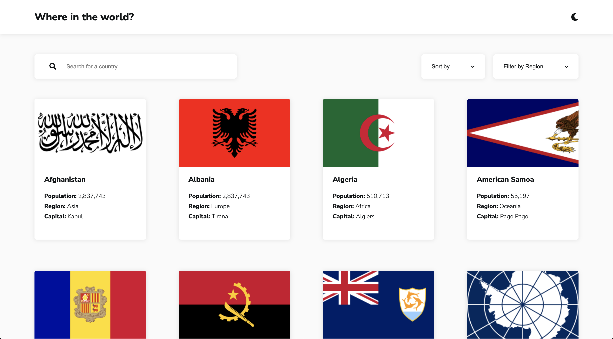
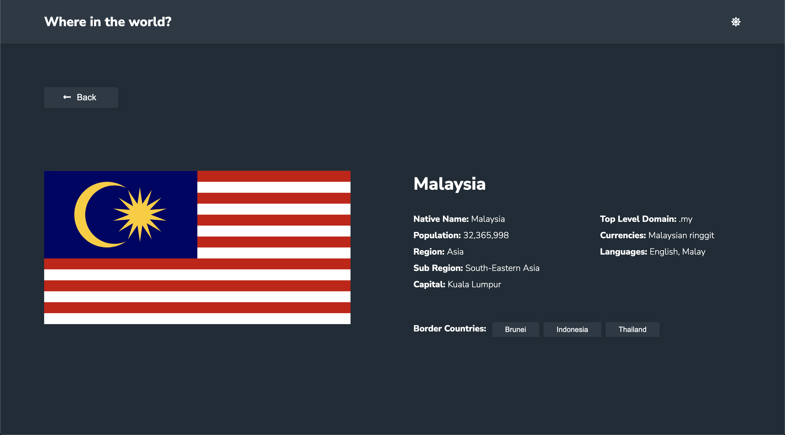

# Frontend Mentor - REST Countries API with color theme switcher solution

This is a solution to the [REST Countries API with color theme switcher challenge on Frontend Mentor](https://www.frontendmentor.io/challenges/rest-countries-api-with-color-theme-switcher-5cacc469fec04111f7b848ca). Frontend Mentor challenges help you improve your coding skills by building realistic projects. 

## Table of contents

- [Overview](#overview)
  - [The challenge](#the-challenge)
  - [Screenshots](#screenshot)
  - [Links](#links)
- [My process](#my-process)
  - [Built with](#built-with)
  - [Useful resources](#useful-resources)

## Overview

### The challenge

Users should be able to:

- See all countries from the API on the homepage
- Search for a country using an `input` field
- Sort countries by name or population
- Filter countries by region
- Click on a country to see more detailed information on a separate page
- Click through to the border countries on the detail page
- Toggle the color scheme between light and dark mode 

### Screenshots

### Links

- Live Site URL: [REST Countries API](https://country-rest-api-sl.netlify.app/)

## My process

### Built with

- Flexbox
- Mobile-first workflow
- [React](https://reactjs.org/) - JS library
- [Styled Components](https://styled-components.com/) - For styles
- [Font Awesome](https://fontawesome.com/v5.15/how-to-use/on-the-web/using-with/react) - For icons

### API
- [REST Countries API](https://restcountries.com/)

### Useful resources

- [Building a dropdown menu in React](https://letsbuildui.dev/articles/building-a-dropdown-menu-component-with-react-hooks) 
- [Toggle colour scheme with Styled Components](https://www.smashingmagazine.com/2020/04/dark-mode-react-apps-styled-components/)

